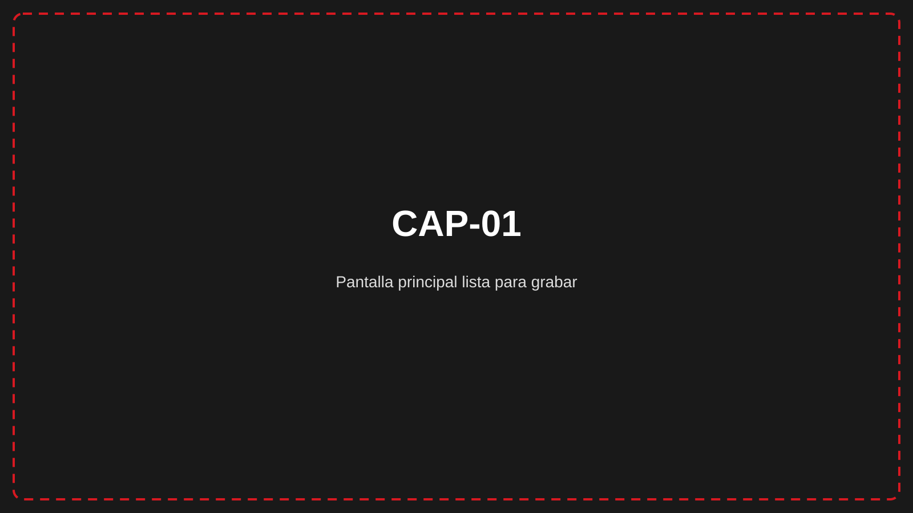
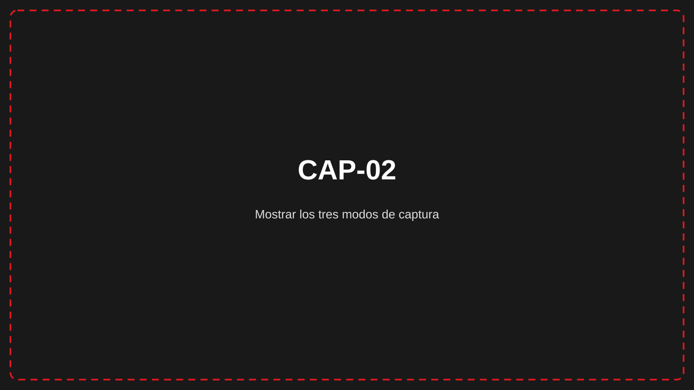
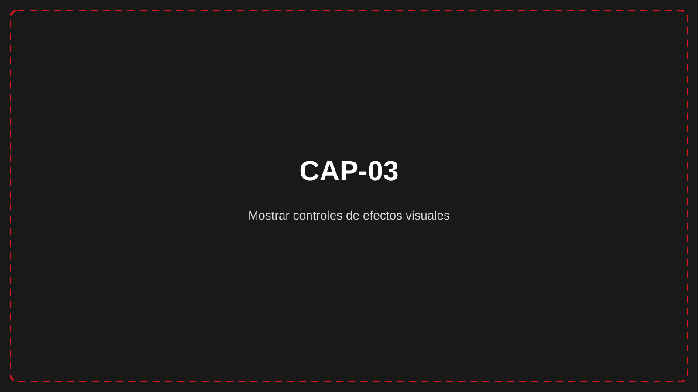
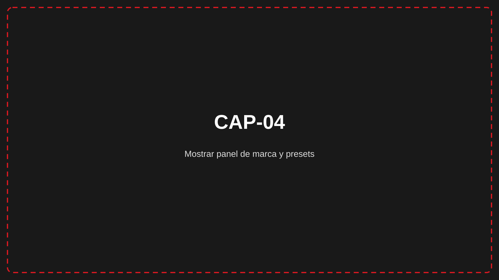
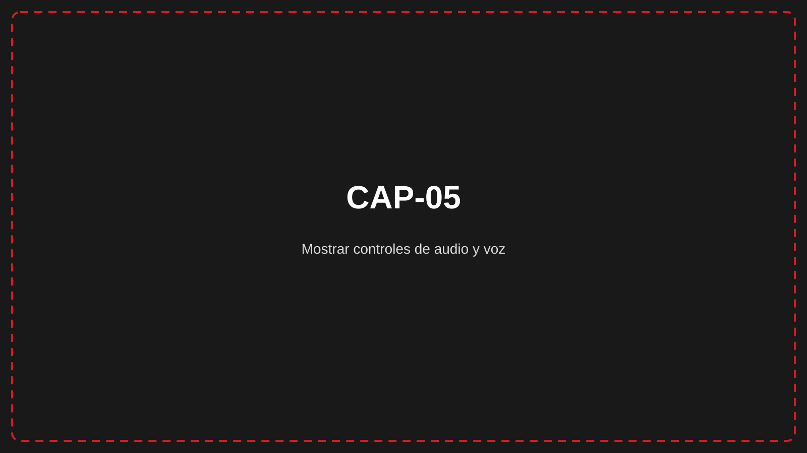

# RecWERTY

## De la pantalla a un video claro, con menos pasos

Una herramienta de escritorio para creadores de contenido técnico, desarrolladores y equipos de soporte que necesitan grabar demos, tutoriales y recorridos de software en Windows. <!-- CLAIM-001: verified -->

## El resultado que buscás

Elegís qué mostrar, configurás audio y presentación, grabás y exportás el resultado como MP4. El flujo está pensado para producir una pieza compartible sin pasar obligatoriamente por un editor externo. <!-- CLAIM-001: verified -->

## Funcionalidades clave

### Mostrá exactamente lo necesario <!-- CLAIM-002: verified -->

**Qué permite conseguir.** Capturar el escritorio completo, una ventana concreta o una zona personalizada para mantener el foco del video.

**Ejemplo de uso.** Un equipo de soporte graba únicamente la ventana de una aplicación para explicar un procedimiento sin mostrar el resto del escritorio.

**Alcance y condiciones.** Disponible en Windows; la zona personalizada se define dibujando un rectángulo y puede cancelarse con **ESC**.

### Hacé visibles clics y movimientos <!-- CLAIM-003: verified -->

**Qué permite conseguir.** Aplicar efectos de clic, estela del cursor, partículas y transiciones para que las acciones en pantalla sean más fáciles de seguir.

**Ejemplo de uso.** Un desarrollador destaca dónde hace clic y cómo recorre una interfaz durante una demostración de producto.

**Alcance y condiciones.** Los efectos son configurables; el preset **Raw/limpio** los desactiva por diseño.

### Conservá una identidad visual coherente <!-- CLAIM-004: verified -->

**Qué permite conseguir.** Configurar logo, colores, tipografía, intro y cierre, y reutilizar esa identidad mediante presets de marca.

**Ejemplo de uso.** Una persona que trabaja con varios proyectos guarda una configuración por marca y cambia de preset antes de grabar cada demo.

**Alcance y condiciones.** Los logos admitidos son PNG o JPG; los presets pueden importarse y exportarse como archivos `.recbrand`.

### Prepará una voz más uniforme <!-- CLAIM-005: verified -->

**Qué permite conseguir.** Procesar la voz con normalización, reducción de ruido, compresión y ecualización durante la preparación del video.

**Ejemplo de uso.** Una persona graba un tutorial con micrófono y activa la mejora de voz para reducir variaciones de volumen y ruido de fondo.

**Alcance y condiciones.** El procesamiento utiliza FFmpeg y la mejora de voz forma parte de las funciones indicadas para la licencia PRO.

### SeguÍ el procesamiento sin perder el contexto <!-- CLAIM-006: verified -->

**Qué permite conseguir.** Ver nombre, progreso y estado de cada trabajo desde una cola de renderizado, y continuar grabando mientras otro video se procesa.

**Ejemplo de uso.** Un creador termina una toma, revisa su progreso en la cola y empieza a preparar la siguiente grabación.

**Alcance y condiciones.** El estado visible cubre trabajos en espera, en proceso, completados o que requieren atención; el resultado final se guarda como MP4.

## Cómo se utiliza

1. Elegí **Pantalla completa**, **Ventana** o **Zona**. <!-- CLAIM-002: verified -->
2. Confirmá micrófono, sonido del sistema, efectos y marca. <!-- CLAIM-003, CLAIM-004, CLAIM-005: verified -->
3. Grabá, revisá la toma y seguí el procesamiento hasta obtener el MP4. <!-- CLAIM-006: verified -->

## Encaje y requisitos

| Aspecto | Alcance verificado |
|---|---|
| Entorno | Windows 10 u 11 de 64 bits |
| Memoria | 8 GB mínimo; 16 GB recomendado |
| Salida principal | Video MP4 |
| Procesamiento | FFmpeg; GPU recomendable para acelerar el procesamiento |
| Idiomas de la aplicación | Español, English y Français |

## Próximo paso

Consultá el manual público de RecWERTY para revisar requisitos, instalación y el flujo de la primera grabación: **https://alfonsoautomatiza.github.io/recwerty/** <!-- CLAIM-007: verified -->
